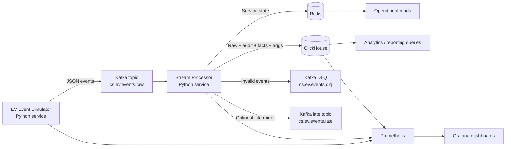

# ChargeSquare EV Charging Data Pipeline

A Docker-first, Python-based data engineering case study for EV charging telemetry.

This repository implements a complete local pipeline:

`Simulator -> Kafka -> Stream Processor -> Redis + ClickHouse -> Prometheus/Grafana`

The system is built to demonstrate practical engineering judgment for a 5-7 day case-study scope: clear contracts, runnable architecture, explicit data quality policy, and measurable behavior under load.

## Problem Statement

EV charging networks produce high-volume, event-time telemetry that must satisfy two competing needs:

- low-latency serving state for operational views
- durable analytical history for audits, KPIs, and session-level reporting

This project models that split explicitly:

- Redis is used for current serving state and dedup marker TTL keys
- ClickHouse is used for historical record, audit tables, finalized session facts, and minimal aggregates

## Architecture At A Glance



## Layer Responsibilities

- Simulator: emits realistic EV charging events, including controlled duplicates, out-of-order, and too-late injections.
- Kafka: buffers and transports immutable event streams between producer and processor.
- Stream Processor: validates, deduplicates, classifies lateness, updates state, and writes analytical sinks.
- Redis: serves current operational state and dedup TTL markers.
- ClickHouse: persists historical/audit/fact/aggregate data for analytical queries.
- Prometheus/Grafana: collects and visualizes throughput, lag, latency, and sink-health metrics.

## Technology Choices And Rationale

- Python: fast iteration for simulator + processor + benchmark tooling in one language.
- Kafka: decouples producer/consumer rates, supports partitioned scaling and replayable transport.
- Redis: low-latency hash-based serving state with timestamp-guard freshness and TTL-based dedup keys.
- ClickHouse: append-friendly analytical store with efficient MergeTree layouts for time-based facts and aggregates.
- Docker Compose: single-command local orchestration with deterministic service wiring.
- Prometheus + Grafana: metrics-first observability for throughput, lag, latency, and sink health.

## Frozen Contracts Implemented

### Kafka Topics

- `cs.ev.events.raw`
- `cs.ev.events.dlq`
- `cs.ev.events.late` (optional mirror for late-rejected events)

### Event Types

- `SESSION_START`
- `METER_UPDATE`
- `STATUS_CHANGE`
- `SESSION_STOP`
- `HEARTBEAT`
- `FAULT_ALERT`

### ClickHouse Tables

- `raw_events`
- `dead_letter_events`
- `late_events_rejected`
- `fact_sessions`
- `agg_station_minute`
- `agg_operator_hour`
- `agg_city_day_faults`

### Redis Key Patterns

- `station:{station_id}:state`
- `station:{station_id}:connector:{connector_id}:state`
- `session:{session_id}:state`
- `dedup:{event_id}`

## End-To-End Data Flow

1. Simulator generates canonical JSON envelope events with realistic station/session lifecycle behavior.
2. Events are published to Kafka raw topic `cs.ev.events.raw`.
3. Processor consumes in batches with manual offset commits.
4. Processor executes parse + schema validation + semantic validation.
5. Invalid records are routed to Kafka DLQ and ClickHouse `dead_letter_events`.
6. Valid records are deduplicated by `event_id` (Redis TTL backend, in-memory fallback).
7. Lateness is classified from `event_time` against receive time.
8. Too-late events are rejected into `late_events_rejected` (and optionally mirrored to Kafka late topic).
9. Accepted events update in-memory session working state and aggregate accumulators.
10. Accepted events write raw history to ClickHouse and serving state to Redis.
11. Session terminal/timeout paths finalize append-once rows into `fact_sessions`.
12. Aggregates flush finalized windows into aggregate tables.
13. Sink worker flush succeeds -> dedup reservations commit -> Kafka offsets commit.

## Event Processing Semantics

### Validation

- Parse-level failures: empty/malformed payloads.
- Schema-level failures: missing required envelope fields or invalid payload model.
- Semantic failures: business checks (session identity mismatch, invalid stop without active session, invalid numeric constraints).
- Semantic warnings are tracked separately from hard failures.

### Deduplication

- Dedup key: `event_id`.
- Policy: duplicates are counted and discarded.
- Implementation detail: staged reserve/commit model.
- On sink failure, reserved IDs are released; on sink success, IDs are committed with TTL.

### Late Event Policy

- Business time is `event_time`.
- `allowed_lateness_seconds` is configurable (default: 600s).
- `0 < lateness <= allowed`: accepted-late.
- `lateness > allowed`: rejected to `late_events_rejected`.
- No retro-correction from ultra-late rejected events.

### Session Finalization

- Working session state is maintained in-memory inside processor.
- Finalization paths are `normal_stop`, `fault_termination`, and `inactivity_timeout`.
- `fact_sessions` rows are append-once final facts.

### Redis Freshness Guards

- Redis writes are timestamp-guarded with `last_event_time_ms` via Lua script.
- Older/equal event-time writes are skipped as stale (counted in metrics).

## Storage Design

### Redis (Serving State)

Redis stores only current-state materializations and dedup markers.

- Station hash: current status, power, active session count, fault flag, last timestamps.
- Connector hash: connector status/session/power/meter/fault view.
- Session hash: live/finalized compact session snapshot with TTL.
- Dedup key: `dedup:{event_id}` TTL marker.

Redis is intentionally not used as historical source of truth.

### ClickHouse (System Of Record)

ClickHouse stores immutable event history, audits, final facts, and minimal pre-aggregates.

- `raw_events`: accepted event history partitioned by event month.
- `dead_letter_events`: parse/schema/semantic rejects with reason and raw payload.
- `late_events_rejected`: rejected late events with computed lateness.
- `fact_sessions`: finalized append-once session facts.
- `agg_station_minute`, `agg_operator_hour`, `agg_city_day_faults`: finalized window rows.

Aggregate rows are emitted only when windows are complete (or forced on shutdown), not per-event upserts.

## Run The Project

### 1) Prerequisites

- Docker + Docker Compose
- Optional host Python for benchmarks/tests: Python 3.12+

### 2) Configure Environment

```bash
cp .env.example .env
```

### 3) Start Full Stack

```bash
docker compose up -d --build
```

This starts:

- Zookeeper, Kafka, Kafka topic init job
- Redis
- ClickHouse (DDL auto-init from `sql/clickhouse/*.sql` on first startup)
- Processor
- Simulator
- Prometheus
- Grafana

### 4) Check Health

```bash
docker compose ps
docker logs -f cs-processor
docker logs -f cs-simulator
```

### 5) Access Endpoints

- Grafana: `http://localhost:3000` (admin / `Jm7TRdE@mZYZ98`)
- Prometheus: `http://localhost:9090`
- Processor metrics: `http://localhost:9100/metrics`
- Simulator metrics: `http://localhost:9200/metrics`
- ClickHouse HTTP API: `http://localhost:8123`

## Load-Test Compose Profiles

### 1k tier

```bash
docker compose -f docker-compose.yml -f docker-compose.loadtest.yml up -d --build
```

### 10k tier (single-instance override)

```bash
docker compose -f docker-compose.yml -f docker-compose.loadtest.10k.yml up -d --build
```

### 10k tier (scaled)

```bash
docker compose -f docker-compose.yml -f docker-compose.loadtest.10k.yml -f docker-compose.loadtest.scaled.yml up -d --build
```

### 100k stress tier (scaled)

```bash
docker compose -f docker-compose.yml -f docker-compose.loadtest.100k.yml -f docker-compose.loadtest.scaled.yml up -d --build
```

Scaled mode adds `simulator-b`, `processor-b`, `processor-c`, `processor-d`.
In scaled compose, simulator target EPS scaling is intentionally split (`0.5` + `0.4`) to reduce overshoot pressure.

## Verify Data Quickly

### ClickHouse counts

```bash
curl "http://localhost:8123/?user=default&password=password&query=SELECT%20count()%20FROM%20raw_events"
curl "http://localhost:8123/?user=default&password=password&query=SELECT%20count()%20FROM%20fact_sessions"
curl "http://localhost:8123/?user=default&password=password&query=SELECT%20count()%20FROM%20late_events_rejected"
```

### Redis serving keys

```bash
docker exec -it cs-redis redis-cli --scan --pattern 'station:*:state' | head
docker exec -it cs-redis redis-cli --scan --pattern 'session:*:state' | head
```

## Benchmarking And Observability

### Benchmark runner

Run from host (if Python deps are installed) or from container.

Host example:

```bash
python3 -m src.benchmarks.run --profile config/benchmarks/1k.yaml
```

Container example:

```bash
docker compose run --rm processor python -m src.benchmarks.run \
  --profile config/benchmarks/1k.yaml \
  --simulator-metrics-url http://simulator:9200/metrics \
  --processor-metrics-url http://processor:9100/metrics
```

Outputs are written to:

- `benchmark_results/runs/<run_id>/result.json`
- `benchmark_results/runs/<run_id>/result.csv`
- `benchmark_results/runs/<run_id>/summary.md`
- `benchmark_results/latest/*`
- `benchmark_results/summary.{json,csv,md}`

### Built-in benchmark tiers

- `config/benchmarks/1k.yaml` (sustained)
- `config/benchmarks/10k.yaml` (sustained)
- `config/benchmarks/50k.yaml` (burst)
- `config/benchmarks/100k.yaml` (stress)

### Metrics tracked

- Throughput: generated/accepted EPS
- Quality: parse/schema/semantic failures, duplicates, too-late rejects, DLQ routes
- Lag: Kafka consumer lag
- Latency: ingest lag, processor/e2e, Redis write, ClickHouse insert
- Session finalization counters by reason
- ClickHouse row-write counters by table

### Grafana dashboards

- `ChargeSquare Pipeline Overview`
- `ChargeSquare ClickHouse + Sinks`

## Results And Bottlenecks (Current Repository State)

### What is evidenced in-repo

- End-to-end implementation for simulator, processor, sinks, metrics, and benchmark tooling.
- Automated test coverage exists and passes locally:

```bash
python3 -m unittest discover -s tests -p 'test_*.py'
```

Current observed result in this repository execution context:

- `Ran 39 tests ... OK`

### Benchmark evidence status

- No committed `benchmark_results/` artifacts were present at authoring time.
- Therefore, this README does not claim final sustained EPS or latency achievements.
- The benchmark framework is implemented and ready to generate auditable results.

### Expected bottleneck surfaces at higher load

Based on the implemented design and instrumentation, likely limiting stages are:

- ClickHouse insert latency (single processor sink worker path per processor instance)
- Kafka consumer lag growth under insufficient processor parallelism/batch sizing
- Redis write amplification from frequent serving-state updates
- Python per-event overhead at extreme EPS stress tiers

## Trade-Offs And Limitations

- Single-node local topology (single Kafka broker, single Redis, single ClickHouse) for case-study simplicity.
- Exactly-once semantics are not claimed; design uses at-least-once + dedup by `event_id`.
- Session working state is in-memory in processor; state is not checkpointed across processor restarts.
- Aggregates are in-memory window accumulations flushed as finalized rows, not continuous OLAP MV pipelines.
- Ultra-late rejected events are intentionally not used for historical retro-correction.
- Optional Kafka late-topic mirror exists; canonical rejection audit remains ClickHouse `late_events_rejected`.

## Implemented vs Partial vs Deferred

### Implemented

- Full simulator -> Kafka -> processor -> Redis/ClickHouse flow
- Parse/schema/semantic validation and DLQ routing
- Dedup reserve/commit model with Redis TTL backend
- Lateness classification and late-reject table writes
- Session state machine + timeout sweeper + append-once `fact_sessions`
- Finalized aggregate row emission for all three aggregate tables
- Prometheus metrics and provisioned Grafana dashboards
- Benchmark runner + profile system + result persistence
- Load-test Compose overrides including scaled topology

### Partially implemented

- Benchmark methodology/tooling is complete, but repository does not include final benchmark run artifacts.
- Late-event Kafka mirror is available but should be treated as optional observability path, not primary audit sink.

### Intentionally deferred

- Multi-node production hardening (HA Kafka/Redis/ClickHouse)
- Schema registry / Avro-Protobuf evolution workflow
- Exactly-once transactional guarantees end-to-end
- Notebook/report assets beyond minimal placeholders

## Future Improvements

1. Commit benchmark artifacts for 1k/10k/50k/100k with hardware metadata and sustained windows.
2. Add processor horizontal scale guidance tied to Kafka partitioning strategy.
3. Move session working state to recoverable store if crash recovery guarantees are needed.
4. Add ClickHouse materialized-view pipeline for larger aggregate portfolios.
5. Add schema-registry based contract evolution tests.

## Project Layout

```text
config/                    runtime and benchmark profiles
sql/clickhouse/            ClickHouse DDL (raw/audit/fact/agg)
src/simulator/             event generation and quality injection
src/processor/             ingestion, validation, routing, sinks, finalization
src/benchmarks/            benchmark runner and summary materialization
dashboards/grafana/        provisioned dashboards and datasource config
tests/                     unit-style coverage for key semantics
```

## Shutdown

```bash
docker compose down --remove-orphans
```

To reset state volumes as well:

```bash
docker compose down -v --remove-orphans
```
