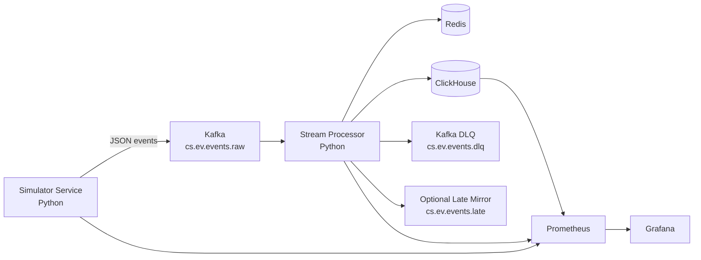

# ChargeSquare Architecture and Technical Design Report

## 1. System Objective and Scope

ChargeSquare models an EV charging telemetry pipeline that supports two product needs at the same time:

- operational serving state (current station/connector/session view)
- analytical and audit history (raw event lineage, quality rejects, finalized session facts, and lightweight aggregates)

The implementation targets case-study constraints:

- Python-first services
- Docker Compose local orchestration
- Kafka as transport
- Redis for serving state + dedup markers
- ClickHouse as analytical system of record
- JSON serialization
- explicit quality and event-time policy

The design favors strong signal-to-effort over platform breadth. It intentionally avoids infrastructure that does not improve submission score for this phase.

## 2. Final Architecture



### Service boundaries

- Simulator: generates realistic session lifecycle events and controlled data-quality perturbations.
- Kafka: transport and decoupling boundary.
- Processor: contract enforcement, dedup/lateness policy, state mutation, sink orchestration.
- Redis: low-latency serving projection and dedup TTL state.
- ClickHouse: append-oriented history/audit/fact/aggregate store.
- Prometheus/Grafana: runtime observability and benchmark evidence collection.

### Frozen contracts reflected in implementation

- Topics: `cs.ev.events.raw`, `cs.ev.events.dlq`, `cs.ev.events.late`
- Redis keys: `station:{station_id}:state`, `station:{station_id}:connector:{connector_id}:state`, `session:{session_id}:state`, `dedup:{event_id}`
- ClickHouse tables: `raw_events`, `dead_letter_events`, `late_events_rejected`, `fact_sessions`, `agg_station_minute`, `agg_operator_hour`, `agg_city_day_faults`
- Event types: `SESSION_START`, `METER_UPDATE`, `STATUS_CHANGE`, `SESSION_STOP`, `HEARTBEAT`, `FAULT_ALERT`

## 3. Event Contract and Processing Semantics

### Canonical envelope

Each event carries a stable envelope including:

- identity: `event_id`, `event_type`, `sequence_no`
- event-time fields: `event_time`, `ingest_time`
- entity keys: `station_id`, `connector_id`, `operator_id`, `session_id`
- metadata: `schema_version`, `producer_id`, `location`
- typed payload by `event_type`

Payload typing is explicit in code (`SessionStartPayload`, `MeterUpdatePayload`, etc.), not generic map-only processing.

### Event-time policy

- business time = `event_time`
- lateness is computed as `(received_at - event_time)` at processor ingress
- configuration default: `allowed_lateness_seconds = 600`
- classifications:
- on-time
- accepted-late (within threshold)
- too-late-rejected (above threshold)

### Quality semantics

- parse/schema/semantic invalid events are rejected and audited
- duplicates are counted and discarded
- too-late rejected events are written to `late_events_rejected`
- no retro-correction of facts from ultra-late rejects

## 4. Stream Processor Design

The processor runs a staged hot path with explicit routing and asynchronous sink flushing.

```mermaid
flowchart TD
    A[Kafka poll batch] --> B[Parse + schema validation]
    B -->|invalid| C[DLQ routing\nKafka + dead_letter_events]
    B -->|valid| D[Semantic validation]
    D -->|invalid| C
    D -->|valid| E[Dedup reserve(event_id)]
    E -->|duplicate| F[Count + discard]
    E -->|unique| G[Lateness classify]
    G -->|too-late| H[late_events_rejected\n(+optional late topic)]
    G -->|accepted| I[Session mutation + agg accumulation]
    I --> J[Build Redis/ClickHouse/Kafka sink batch]
    J --> K[Sink worker flush]
    K -->|success| L[Dedup commit + offset commit]
    K -->|failure| M[Dedup release + stop]
```

### Processor stages

1. Poll from `cs.ev.events.raw` with manual commit.
2. Parse and envelope validation.
3. Semantic validation against current session snapshot.
4. Dedup reserve/commit semantics.
5. Lateness classification.
6. Route to accepted, invalid, duplicate, or too-late paths.
7. Build sink batch for Redis, ClickHouse, DLQ/late Kafka sinks.
8. Flush in sink worker; commit offsets only after successful sink flush.

### Why this shape

- Batching and deferred commit reduce write overhead and avoid acknowledging records before sink durability attempts.
- Reservation-based dedup avoids permanently marking IDs before sink success.
- A single routing model keeps policy decisions explicit and testable.

### Implemented reliability posture

- at-least-once ingestion + dedup by `event_id`
- no cross-system exactly-once transaction
- sink failures trigger reservation release and prevent offset ack for that batch

## 5. Validation, Deduplication, and Late-Event Handling

### Validation layers

- Parse validation: malformed UTF-8/JSON, non-object payloads.
- Schema validation: required fields, typed payload construction, timestamp parsing.
- Semantic validation: session identity consistency, stop-without-session checks, numeric constraints, sequence continuity warnings.

Invalid events are written to:

- Kafka `cs.ev.events.dlq`
- ClickHouse `dead_letter_events`

### Deduplication design

Dedup is performed by `event_id` with staged semantics:

- `reserve_batch`: mark candidate IDs as pending
- sink success: `commit_reserved` -> persist Redis TTL markers (`dedup:{event_id}`)
- sink failure: `release_reserved`

Fallback behavior exists:

- Redis available: Redis-backed dedup
- Redis unavailable: in-memory TTL dedup fallback

### Late-event path

- too-late events do not enter raw history or serving-state updates
- they are audited to `late_events_rejected`
- optional mirror to Kafka late topic exists when `late_events_enabled=true`

Canonical audit sink remains ClickHouse table `late_events_rejected`.

## 6. Redis Design (Serving State Only)

Redis is deliberately constrained to current-state projections and dedup keys.

### Key families

- station state hash
- connector state hash
- session state hash
- dedup TTL keys

### Freshness and ordering guard

Writes are protected by a Lua timestamp guard (`last_event_time_ms`):

- newer event-time writes apply
- stale/equal event-time writes are skipped

This prevents out-of-order updates from corrupting serving state.

### Session TTL behavior

- active session state: longer TTL
- finalized session snapshot: shorter TTL

Timeout finalization path updates station/connector/session keys to terminal state.

### Design intent

Redis is not treated as history. It is a low-latency serving cache with deterministic conflict policy.

## 7. ClickHouse Design (History + Analytics)

ClickHouse is the analytical and audit source of truth.

### Table roles

- `raw_events`: accepted canonical event history
- `dead_letter_events`: invalid contract/audit stream
- `late_events_rejected`: event-time reject audit
- `fact_sessions`: finalized, append-once session facts
- `agg_station_minute`: per-station minute rollup
- `agg_operator_hour`: operator-hour rollup
- `agg_city_day_faults`: city-day fault rollup

### Physical design choices

- MergeTree for all tables
- month-based partitions by event/finalization bucket
- order keys prioritize common analytical filters (station/operator/time)

### Why append-oriented

- preserves lineage and operational debuggability
- avoids expensive mutable correction logic in MVP
- aligns with event-stream processing and late reject policy

## 8. Session Modeling and Aggregate Strategy

### Session modeling

Processor keeps mutable working session snapshots in memory and emits immutable facts on finalization.

Finalization reasons implemented:

- `normal_stop`
- `fault_termination`
- `inactivity_timeout`

`fact_sessions` is append-once and includes commercial and operational attributes:

- duration, energy, revenue
- completion flags
- peak/avg power
- stop/finalization reason

### Aggregate strategy

Aggregates are accumulated in-memory and flushed as finalized window rows:

- minute windows for station metrics
- hour windows for operator metrics
- day windows for city fault metrics

Rows are emitted only when the window is complete (or force-flushed on shutdown), avoiding mutable upsert loops in MVP.

## 9. Benchmarking and Observability Design

### Metrics architecture

- simulator exports throughput/injection/session-control metrics
- processor exports quality, lag, sink, and latency metrics
- ClickHouse exports native Prometheus metrics (`/metrics`, port 9363)

Grafana dashboards are provisioned from repo:

- pipeline overview (EPS, lag, quality, latency, sink rates)
- ClickHouse + sink dashboard (query/insert/io/memory)

### Benchmark runner philosophy

`src/benchmarks/run.py` is designed for reproducible local evidence:

- profile-driven runtime windows
- optional process launch
- Prometheus snapshot delta computation
- Redis read micro-benchmark
- ClickHouse analytical query benchmark
- persisted machine-readable and markdown summaries

Outcome rubric in code:

- `pass` if achieved EPS >= 90% target
- `partial` if >= 70%
- else `fail`

Primary bottleneck classification in code is heuristic and explicit:

- consumer lag growth
- ClickHouse insert latency
- Redis write latency
- processor throughput ceiling

## 10. Key Trade-offs and Intentional Non-Goals

### Trade-offs made intentionally

- Single-node local topology over distributed production deployment.
- At-least-once + dedup instead of cross-system transactional exactly-once.
- In-memory session working state for simplicity and speed.
- Minimal aggregate set instead of full BI model sprawl.
- Explicit late reject policy over expensive historical retro-correction.

### Non-goals for this phase

- multi-cluster orchestration (Kubernetes/operator layer)
- schema registry and binary serialization migration
- full replay/backfill correction workflows
- enterprise-grade HA and disaster recovery controls

These were excluded to preserve delivery quality under case-study time limits.

## 11. Bottlenecks and Scale Path

### Current evidence status

No committed `benchmark_results/` directory exists in repository state, so final sustained throughput claims are not asserted in this report.

### Observed structural pressure points

Given implementation details, main pressure points are:

- sink-worker serialization cost per processor instance (Redis + ClickHouse + Kafka side sinks)
- ClickHouse insert latency under high batch pressure
- Kafka lag growth when consumer concurrency < partition throughput demand
- Redis write amplification under high-frequency state updates

### Practical scale path

1. Increase processor replica count in same consumer group and align raw topic partitions.
2. Tune `max_poll_records`, sink batch sizes, and flush intervals per load tier.
3. Expand simulator sharding for cleaner load generation and reduced overshoot.
4. Reduce per-event serving writes where product SLOs allow coarser projections.
5. Introduce recoverable session working-state backend if restart continuity is required.
6. Move from heuristic bottleneck labeling to runbook-backed capacity thresholds.

## 12. Conclusion

The implemented system is deliberately split between:

- fast mutable serving projections (Redis)
- append-oriented analytical truth and auditability (ClickHouse)

Kafka provides transport and decoupling, while the processor enforces strict quality semantics (validation, dedup, event-time lateness) before state mutation.

This architecture is intentionally pragmatic for MVP scope: reliable enough for credible benchmark and observability narratives, simple enough to remain explainable, and structured enough to scale by increasing parallelism and sink efficiency rather than redesigning core contracts.
